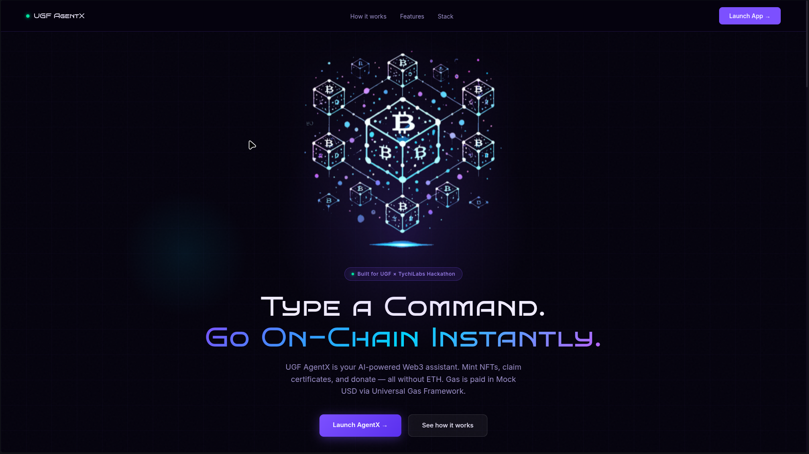
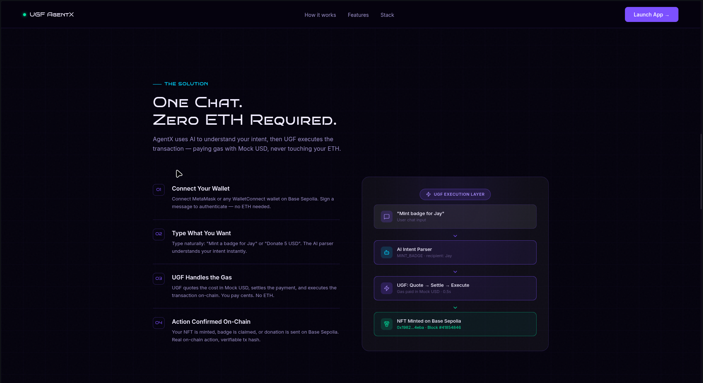
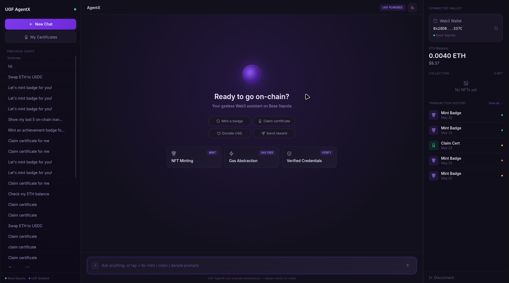
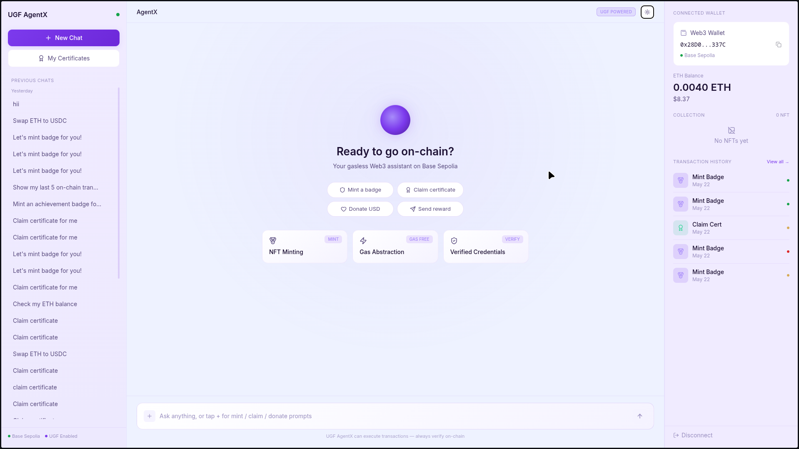
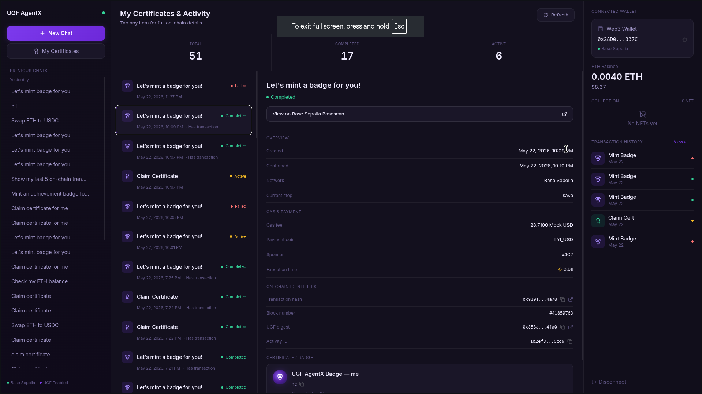

# UGF AgentX

**Conversational Gasless Web3 Assistant** — chat with an AI agent to mint NFT badges, donate, claim certificates, and run other on-chain actions without paying gas yourself. Transactions are sponsored through the [Universal Gas Framework (UGF)](https://universalgasframework.com) on **Base Sepolia**.

## Live website

**[https://ugfagentx.medicares.in](https://ugfagentx.medicares.in)**

## Screenshots

Previews from [`Frontend/public/websiteimage/`](Frontend/public/websiteimage/). In the running app, these are served at `/websiteimage/…`.

### Landing page

<table>
  <tr>
    <td width="50%" valign="top" align="center">
      <strong>Hero — type a command, go on-chain</strong><br/><br/>
      
    </td>
    <td width="50%" valign="top" align="center">
      <strong>Solution — one chat, zero ETH required</strong><br/><br/>
      
    </td>
  </tr>
</table>

### AgentX chat dashboard

<table>
  <tr>
    <td width="50%" valign="top" align="center">
      <strong>Dark mode — welcome & quick actions</strong><br/><br/>
      
    </td>
    <td width="50%" valign="top" align="center">
      <strong>Light mode — same layout, theme toggle</strong><br/><br/>
      
    </td>
  </tr>
</table>

### Certificates & on-chain activity

<table>
  <tr>
    <td align="center">
      <strong>My Certificates & Activity — timeline, gas in Mock USD, badge preview</strong><br/><br/>
      
    </td>
  </tr>
</table>

## Features

- **Natural-language chat** — describe what you want (mint a badge, donate, check balance, view history); the backend parses intent and responds with guided steps.
- **Suggested prompts (+ menu)** — tap **+** in the chat bar, pick a category (e.g. Claim certificate), choose a sub-prompt, edit if needed, then send.
- **Gasless on-chain execution** — UGF handles gas sponsorship; users pay with TYI Mock USD from a connected wallet or a configured server signer.
- **Wallet authentication** — sign a nonce with your wallet (or Google login for demo) and receive a JWT for protected API routes.
- **Activity & wallet panel** — transaction timeline, NFT gallery, and balance summary in the UI.
- **Smart contract** — ERC721-style badge contract (`mintBadge`, `donate`) deployable on Base Sepolia (see `contracts/` and `Backend/docs/`).

## Tech stack

| Layer | Technologies |
|-------|----------------|
| **Frontend** | React 19, Vite, Tailwind CSS, Zustand, Wagmi, ConnectKit, TanStack Query |
| **Backend** | Node.js, Express, TypeScript, Google Gemini, Supabase (Postgres), JWT |
| **Blockchain** | Base Sepolia, Ethers / Viem, `@tychilabs/ugf-testnet-js` |
| **Deployment** | Vercel (frontend), configurable backend host |

## Project structure

```
UGFAgentX/
├── Frontend/          # Vite + React UI (port 3000)
├── Backend/           # Express API (port 5000)
├── contracts/         # UGFAgentXBadge Solidity + deploy guides
└── vercel.json        # Frontend build config for Vercel
```

## Getting started

### Prerequisites

- Node.js 18+
- [Supabase](https://supabase.com) project (URL + keys)
- [Google Gemini API](https://ai.google.dev/) key
- UGF testnet setup: signer key, deployed contract, TYI Mock USD from [UGF faucets](https://universalgasframework.com/faucets)

### Backend

```bash
cd Backend
cp .env.example .env
# Edit .env with your keys (see Backend/docs/SETUP_UGF.md)
npm install
npm run dev
```

API runs at `http://localhost:5000`. Health check: `GET /health`.

### Frontend

```bash
cd Frontend
npm install
npm run dev
```

App runs at `http://localhost:3000`. Set `FRONTEND_URL` in the backend `.env` to match your browser origin for CORS.

### Using suggested prompts

1. In the chat composer, tap the **+** button (left of the input).
2. Select a category — **Mint badge**, **Claim certificate**, **Donate**, **Swap**, etc.
3. Pick a sub-prompt; it fills the input (you can edit before sending).
4. Press **Send** or Enter. AgentX parses the message and runs the matching on-chain flow when configured.

Prompt labels and sub-prompts are defined in `Frontend/src/lib/promptCatalog.ts`.

### On-chain setup

1. Deploy `UGFAgentXBadge` on Base Sepolia — [Remix quickstart](Backend/docs/REMIX_QUICKSTART.md) or [full deploy guide](Backend/docs/DEPLOY_CONTRACT_BASE_SEPOLIA.md).
2. Set `UGF_SIGNER_PRIVATE_KEY` and `NFT_CONTRACT_ADDRESS` in `Backend/.env`.
3. Fund the payer wallet with TYI Mock USD via the [UGF dashboard / faucets](https://universalgasframework.com/faucets).
4. Verify: `npm run check:ugf` (in `Backend/`).

## API overview

| Area | Examples |
|------|----------|
| Auth | `POST /api/auth/nonce`, `POST /api/auth/verify` |
| Chat | `POST /api/chat`, sessions & history under `/api/chat/*` |
| Transactions | Gallery, wallet summary, activity |
| UGF | `POST /api/ugf/execute` (quote → settle → execute when configured) |

See [Backend/BACKEND_IMPLEMENTATION_STATUS.md](Backend/BACKEND_IMPLEMENTATION_STATUS.md) for a detailed backend status and endpoint list.

## Related links

- **Live app:** [https://ugfagentx.medicares.in](https://ugfagentx.medicares.in)
- **UGF (Universal Gas Framework):** [https://universalgasframework.com](https://universalgasframework.com)
- **UGF testnet faucets:** [https://universalgasframework.com/faucets](https://universalgasframework.com/faucets)
- **Repository:** [https://github.com/Karangupta97/UGFAgentX](https://github.com/Karangupta97/UGFAgentX)

## License

ISC (backend package). See individual package files for other licenses.
